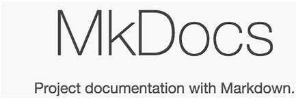

<h1 style="color:orange">About the Docker</h1>
## Docker là gì?

> **Docker** là một tập hợp các sản phẩm nền tảng dưới dạng dịch vụ (PaaS) sử dụng ảo hóa cấp hệ điều hành để phân phối phần mềm trong các gói được gọi là vùng chứa. Các vùng chứa được cách ly với nhau và đóng gói phần mềm, thư viện và tệp cấu hình của riêng chúng; họ có thể giao tiếp với nhau thông qua các kênh được xác định rõ ràng. Tất cả các bộ chứa đều được điều hành bởi một nhân hệ điều hành duy nhất và do đó sử dụng ít tài nguyên hơn máy ảo.

>> **Docker file**: tệp cấu hình cho docker image chạy container chứa nhiều lệnh thay vì gõ từng lệnh trên command prompt
>> **Docker Compose**: tệp cấu hình chạy nhiều container dựa trên image đã có
## Docker Architechture
:bulb: 
> Docker sử dụng kiến ​​trúc client-server. Máy khách Docker giao tiếp với trình nền docker giúp xây dựng, chạy và phân phối các vùng chứa docker. Máy khách Docker chạy với daemon trên cùng một hệ thống hoặc chúng ta có thể kết nối máy khách Docker với daemon Docker từ xa. Với sự trợ giúp của API REST qua ổ cắm UNIX hoặc mạng, máy khách docker và daemon tương tác với nhau.
:bulb: [Chi tiết](https://www.geeksforgeeks.org/architecture-of-docker/)
## Mkdocs là gì?

> Mkdocs là một bộ sinh tự động các trang web tĩnh dành cho xây dựng các trang web tài liệu với ưu điểm nhanh, đơn giản và đẹp.
> Mkdocs được tạo ra nhằm đưa ra giải pháp tốt cho việc tiếp cận tài liệu kỹ thuật.
Bắt đầu từ sự cần thiết các trang tài liệu người dùng trong dự án protobluff năm 2015.
Tác giả Martin Donath đã chọn Mkdocs vì sự đơn giản và tập trung vào dự án tài liệu nhưng nhận thấy vài sự thiếu hụt về các chủ đề.
Năm 2016, phiên bản Mkdocs đầu tiên được phát hành và sau đó đã trở nên phổ biến.
:bulb: [Chi tiết](https://www.mkdocs.org/)
