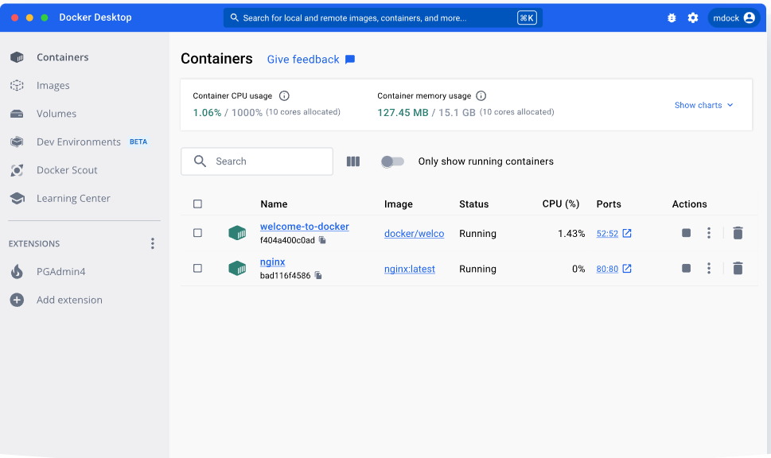
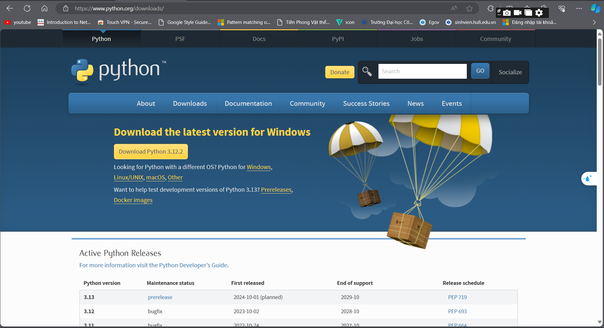

# Docker
1. Truy cập: [Docker Install](https://www.docker.com/products/docker-desktop/)
2. Chọn Download For Windows
3. Ctrl + R: để kiểm tra phiên bản đã tải
```bash
    docker --version
```
4. Khởi động Docker Desktop
>> Kết quả

---------------------------
# Mkdocs
1. Tải Python tại [Python Install](https://www.python.org/downloads/)

2. Chọn version mới nhất cho Windows
3. Ctrl + R: kiểm tra đã tải
``` bash
    python --version
```

``` bash
    pip --version
```
4. Tải Mkdocs bằng pip
```bash
    pip install mkdocs
```
5. Kiểm tra phiên bản:
```bash
    python -m mkdocs --version
```