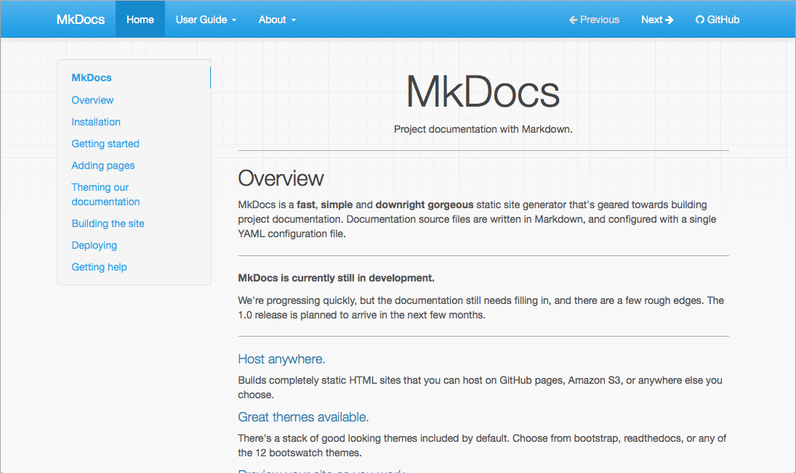
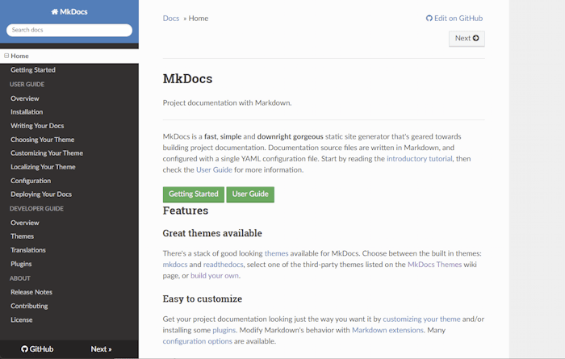
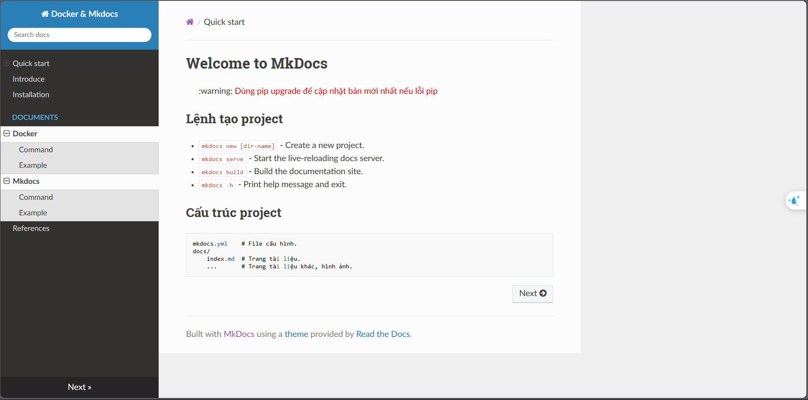

## Cài đặt SQL Server Docker
>  <mark>Bước 1</mark>: Tạo project
``` bash 
python -m mkdocs new
```
>  <mark>Bước 2</mark>: Cấu hình mkdocs.yml
``` bash 
site_name: Docker & Mkdocs
nav:
  - Quick start: index.md
theme:
  name: readthedocs
```
> **Theme**: có hai dạng giao diện hỗ trợ sẵn từ Mkdocs
>> 1. mkdocs:
>> 
>> 2. readthedocs:
>> 

> **nav**: navigation các trang markdown có thể cấu trúc dạng list để liên kết các trang markdown (.md)

<mark>Bước 3</mark>: Chạy website
``` bash 
python -m mkdocs serve
```
>  <mark>Bước 4</mark>: Kết quả


